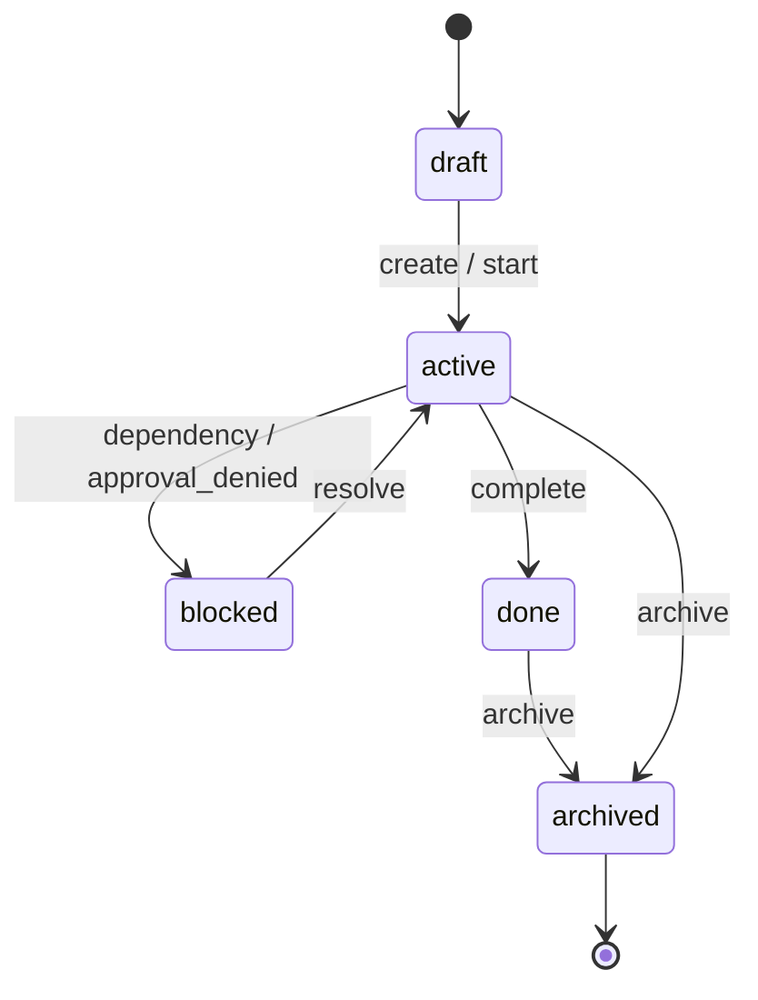
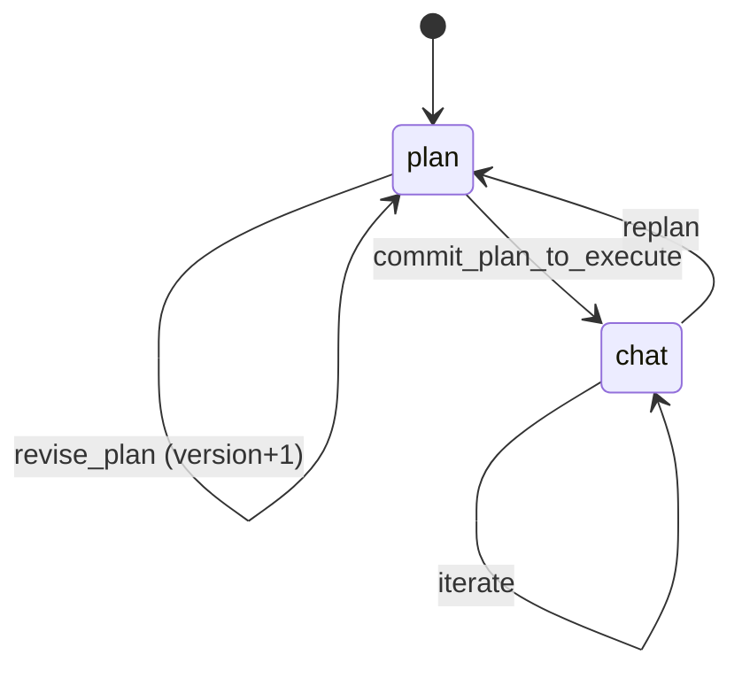
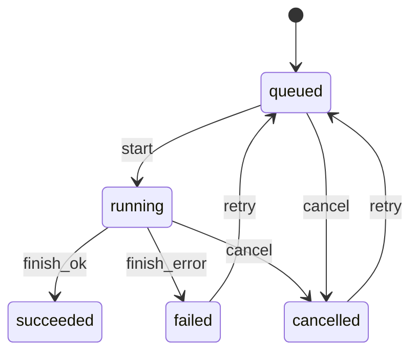
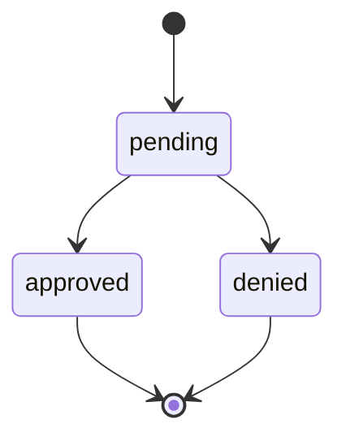

# TypeClaw 数据模型与状态机（v0.1）

本文是 TypeClaw（个人助手 Agent）的工程落地文档之一，目标是让前后端、执行引擎、存储层围绕同一套“可持久化、可检索、可复用”的数据结构协作。

## 1. 分层上下文模型（Layered Context）

TypeClaw 的上下文由四层组成，越往下越短期、越高频变化：

1. Identity（身份与偏好）
   - 用户画像、语言偏好、默认模型、默认专家、默认安全策略等
2. Memory（长期记忆）
   - 可搜索、结构化、可编辑的知识条目（facts / preferences / skills usage patterns / templates）
3. Session（会话/任务的短期上下文）
   - 当前任务摘要、最近 N 条对话摘要、执行中 run 状态摘要
4. Input（当前输入）
   - 用户本次指令 + 选中内容 + 附件引用

落地建议：每次执行都由执行引擎生成一份 “Context Snapshot”，用于审计与可复现。

## 2. 核心实体（Entities）

### 2.1 Workspace

用于隔离个人不同领域（工作/生活/副业），也用于后续同步与权限控制。

| 字段 | 类型 | 说明 |
|---|---|---|
| id | string | 主键 |
| name | string | 工作空间名称 |
| createdAt / updatedAt | number | 时间戳 |

### 2.2 Task

任务是系统的“工作单元”。会话与工具执行都应归档到任务。

| 字段 | 类型 | 说明 |
|---|---|---|
| id | string | 主键 |
| workspaceId | string | 所属 workspace |
| title | string | 标题 |
| description | string | 任务描述/目标 |
| status | enum | draft / active / blocked / done / archived |
| priority | enum | low / normal / high（可选） |
| mode | enum | plan / chat（当前模式） |
| selectedSkillIds | string[] | 任务允许使用的技能集合（白名单） |
| selectedExpertIds | string[] | 任务默认专家集合 |
| planDoc | PlanDoc | 规划文档（结构化） |
| activeSessionId | string | 当前活跃会话 |
| createdAt / updatedAt | number | 时间戳 |

### 2.3 PlanDoc（规划文档）

规划模式的产物，应结构化，支持从 Plan 一键转 Chat 执行。

| 字段 | 类型 | 说明 |
|---|---|---|
| version | number | 版本号（每次重规划 +1） |
| goal | string | 目标 |
| assumptions | string[] | 假设 |
| steps | PlanStep[] | 执行步骤 |
| risks | string[] | 风险与对策 |
| requiredSkills | string[] | 建议技能 |
| createdAt | number | 时间戳 |

PlanStep：

| 字段 | 类型 | 说明 |
|---|---|---|
| id | string | 主键 |
| title | string | 步骤名 |
| description | string | 说明 |
| skillId | string? | 绑定技能（可空） |
| inputs | Record<string, unknown> | 参数草案 |
| dependsOn | string[] | 依赖步骤 |
| status | enum | todo / doing / done / skipped |

### 2.4 Session（会话）

会话是消息流容器。一个任务可有多个会话（例如：多轮尝试）。

| 字段 | 类型 | 说明 |
|---|---|---|
| id | string | 主键 |
| taskId | string | 所属任务 |
| title | string | 会话标题（可自动生成） |
| status | enum | active / closed |
| summary | string | 会话摘要（压缩后的短记忆） |
| createdAt / updatedAt | number | 时间戳 |

### 2.5 Message（消息）

消息分为用户、模型、系统与工具/执行事件四类。UI 渲染应按 type 走不同组件。

| 字段 | 类型 | 说明 |
|---|---|---|
| id | string | 主键 |
| sessionId | string | 所属会话 |
| role | enum | user / assistant / system / tool |
| type | enum | text / markdown / plan / run_card / artifact / error |
| content | string | 文本内容（或 markdown） |
| meta | object | 附加字段：引用、source、tokens、etc |
| createdAt | number | 时间戳 |

### 2.6 Skill（技能）

技能是可执行单元，具备 manifest、输入输出 schema 与权限声明。

| 字段 | 类型 | 说明 |
|---|---|---|
| id | string | 主键 |
| name | string | 技能名 |
| version | string | 版本 |
| description | string | 描述 |
| inputSchema | JSONSchema | 输入 |
| outputSchema | JSONSchema | 输出 |
| permissions | Permission[] | 权限声明 |
| enabled | boolean | 开关 |
| config | object | 技能配置（可加密字段引用） |

Permission（建议）：

| scope | enum | network / fs_read / fs_write / clipboard / calendar / email / shell |
| level | enum | safe / sensitive / destructive |
| prompt | string | 展示给用户的审批文案 |

### 2.7 ExpertProfile（专家）

专家是 prompt profile：系统提示 + 方法论 + 输出规范 + 工具偏好。

| 字段 | 类型 | 说明 |
|---|---|---|
| id | string | 主键 |
| name | string | 名称 |
| description | string | 简介 |
| tags | string[] | 标签 |
| systemPrompt | string | system 提示 |
| styleGuidelines | string | 风格规范 |
| constraints | string[] | 约束（安全/格式/口吻） |
| toolPreference | string[] | 偏好的技能/工具 |
| enabled | boolean | 是否可用 |

### 2.8 Run（工具执行 / 工作流执行）

Run 是工具执行的可审计单位，必须支持中断与重试。

| 字段 | 类型 | 说明 |
|---|---|---|
| id | string | 主键 |
| taskId | string | 所属任务 |
| sessionId | string | 所属会话 |
| mode | enum | plan_step / chat_tool / automation |
| skillId | string | 使用的技能 |
| status | enum | queued / running / succeeded / failed / cancelled |
| steps | RunStep[] | 分步执行 |
| approvals | Approval[] | 审批记录 |
| artifacts | Artifact[] | 产物 |
| error | ErrorInfo? | 错误信息 |
| startedAt / endedAt | number | 时间戳 |

RunStep：

| 字段 | 类型 | 说明 |
|---|---|---|
| id | string | 主键 |
| name | string | 步骤名（UI 显示） |
| status | enum | queued / running / succeeded / failed / cancelled |
| input | object | 输入快照（可脱敏/引用式存储） |
| output | object | 输出（或引用） |
| logs | LogItem[] | 结构化日志 |
| startedAt / endedAt | number | 时间戳 |

LogItem：

| 字段 | 类型 | 说明 |
|---|---|---|
| level | enum | debug / info / warn / error |
| message | string | 日志 |
| ts | number | 时间戳 |

Approval：

| 字段 | 类型 | 说明 |
|---|---|---|
| id | string | 主键 |
| runId | string | 所属 run |
| scope | string | 权限范围 |
| reason | string | 触发原因 |
| decision | enum | approved / denied |
| decidedAt | number | 时间戳 |

### 2.9 Artifact（产物）

产物是任务资产沉淀的关键，支持“可复用”与“可导出”。

| 字段 | 类型 | 说明 |
|---|---|---|
| id | string | 主键 |
| taskId | string | 所属任务 |
| sessionId | string? | 来源会话 |
| runId | string? | 来源执行 |
| type | enum | file / link / note / structured |
| title | string | 标题 |
| uri | string | file path / url / internal ref |
| meta | object | mime、size、schema 等 |
| createdAt | number | 时间戳 |

### 2.10 MemoryItem（长期记忆）

长期记忆必须结构化、可搜索、可编辑。

| 字段 | 类型 | 说明 |
|---|---|---|
| id | string | 主键 |
| workspaceId | string | 所属 workspace |
| type | enum | fact / preference / profile / template / skill_chain |
| title | string | 标题 |
| content | string | 可读内容（markdown） |
| data | object | 结构化字段（可选） |
| tags | string[] | 标签 |
| sourceRefs | object[] | 来源：taskId/sessionId/messageId |
| createdAt / updatedAt | number | 时间戳 |

## 3. 状态机（State Machines）

### 3.1 Task 状态机

### 3.2 Task Mode（Plan ↔ Chat）状态机

规则建议：
- planDoc.version 自增，且每次 commit 生成一份 “execution snapshot”（用于审计/复现）。
- chat 中触发 replan 后，原 plan 保留（不可覆盖式丢失），便于回溯。

### 3.3 Run 状态机（可中断）

### 3.4 Approval 状态机

规则建议：
- denied 必须写入 Run.error，并标记 Task 可转 blocked（由策略决定）。

## 4. 事件与可追溯性（Auditability）

为支持“可解释、可控”，建议所有关键动作都产生日志事件：
- task.created / task.mode_changed / task.completed
- plan.version_created / plan.committed
- run.created / run.step_started / run.step_finished / run.finished
- approval.requested / approval.decided
- memory.extracted / memory.edited

落地建议：事件采用 append-only 存储，UI 可基于事件流实时渲染 Run Card。

